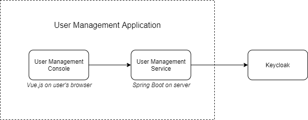

# MOH User Management

The User Management application allows administrators to administer users stored in Keycloak. It consists of the [User Management Console frontend](frontend) (Vue.js) and [User Management Service backend](backend) (Spring Boot), and it depends on a Keycloak server. Detailed set-up instructions for each component are included in the README files in the subdirectories.

